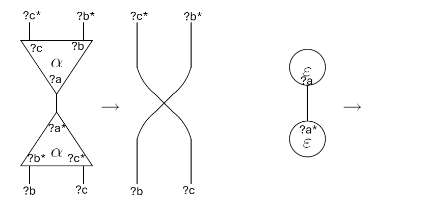
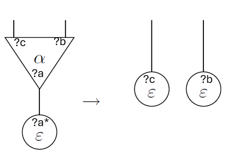
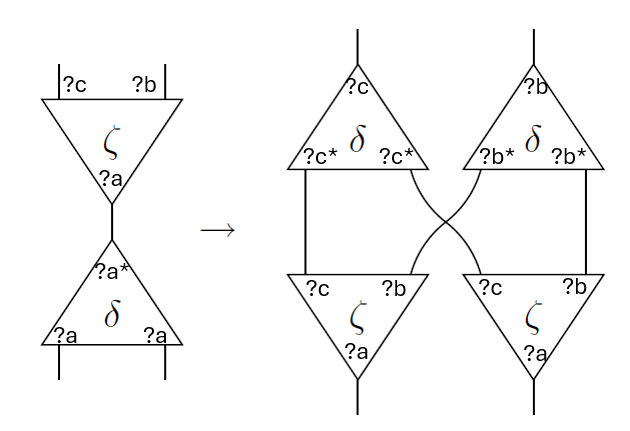

## Nodes

### Erasers - epsilon:
- N_ERA - Negative (Value) Eraser, (-)
- P_ERA - Positive (Consumer) Eraser (+)

### Duplicators - delta:
- DUP - Duplicator (-/+/+)
- SUP - Superposer (+/-/-)

### Constructors - zeta:
- LAM  - Lambda (+/+/-)
- APL  - Application (-/-/+)
- LMA  - Mirrored Lambda (+/-/+)
- ALP  - Mirrored Application (-/+/-)
- PAIR - Pair (+/-/-)
- UNPAIR - Unpair (-/+/+)

## Interaction Rules
### Annihilations
Each node (?a/?b/?c) annihilates with its inverted version (?a*/?b*/?c*).

### Erasures
Any node (?a/?b/?c) is erased by an eraser (?a*), resulting with two erasers (?b) (?c).

### Duplications
Any zeta node with polarities (?a/?b/?c) is duplicated by a delta node (?a*/?a/?a) (Which is either DUP or SUP).

Resulting with two copies of zeta (?a/?b/?c) and two deltas (?b/?b*/?b*) (?c/?c*/?c*) (Either one is either DUP or SUP). Polarities can be verified in the illustration below.

## Polarity Constraints
From this we can derive polarity constraints for an SIC net to be interpretable as PIC (Polarized Interaction Combinators).

General constraints:
- Connected ports have opposite polarity
- Free ports have negative polarity.

PIC specific constraints:
- Delta nodes have (?a/?a*/?a*) polariry
- Zeta nodes do not have (?a/?a/?a) polarity.
- Interacting Zeta nodes have opposite polarity (?a/?b/?c) ~ (?a*/?b*/c*)

We can formalize this is as a SAT problem:
Negative will be 0, and positive will be 1.
- if a and b are connected: `a ⊕ b`.
- if a is a free port: `a`.
- For every delta node (a/b/c): `(a ⊕ b) ∧ (a ⊕ c)`
- For every zeta node (a/b/c): `¬(a ∧ b ∧ c) ∧ (a ∨ b ∨ c)`
- if (a/b/c) and (x/y/z) are interacting zeta nodes: `(a ⊕ x) ∧ (b ⊕ y) ∧ (c ⊕ z)`

